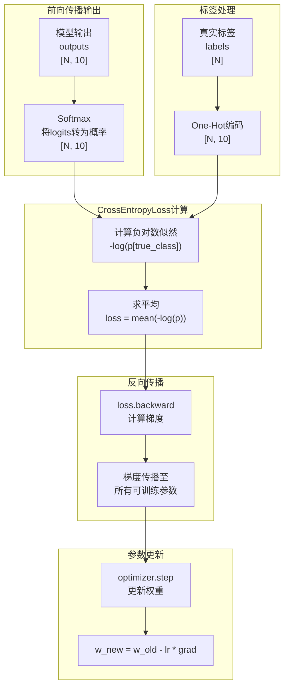
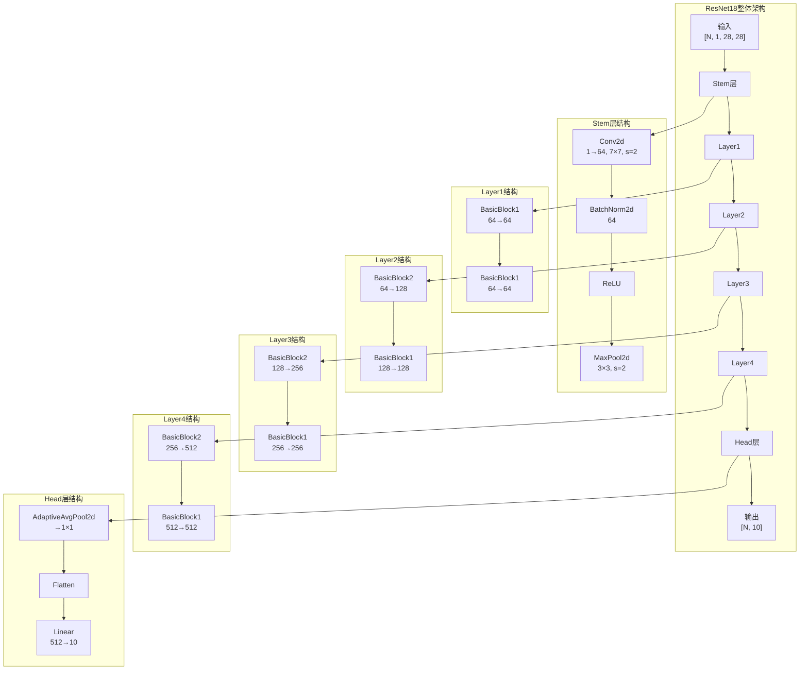
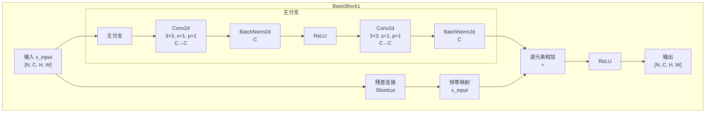
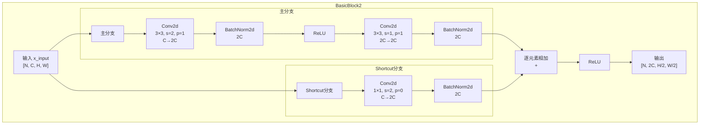
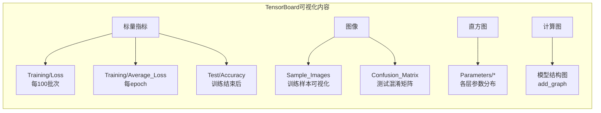
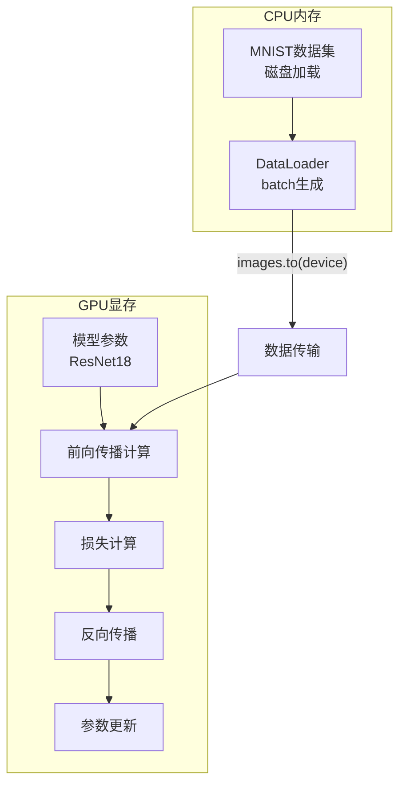
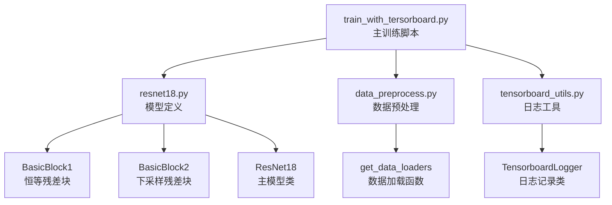

# ResNet18 MNIST 训练项目可视化分析

## 1. 整体训练流程可视化图

```mermaid
flowchart TD
    subgraph "数据准备阶段"
        A["开始"] --> B["MNIST数据集加载<br/>datasets.MNIST"]
        B --> C["数据预处理<br/>ToTensor + Normalize"]
        C --> D["创建DataLoader<br/>batch_size=64"]
    end

    subgraph "模型初始化阶段"
        D --> E["设备检测<br/>CUDA/CPU"]
        E --> F["实例化ResNet18<br/>in_channels=1, num_classes=10"]
        F --> G["模型移至设备<br/>model.to(device)"]
        G --> H["定义损失函数<br/>CrossEntropyLoss"]
        H --> I["定义优化器<br/>SGD lr=0.01 momentum=0.9"]
    end

    subgraph "TensorBoard初始化"
        I --> J["创建TensorboardLogger"]
        J --> K["添加模型结构<br/>add_graph"]
        K --> L["添加样本图像<br/>add_images"]
    end

    subgraph "训练循环<br/>num_epochs=5"
        L --> M["设置训练模式<br/>model.train"]
        M --> N["遍历train_loader"]
        N --> O["数据移至device"]
        O --> P["optimizer.zero_grad"]
        P --> Q["前向传播<br/>model(images)"]
        Q --> R["计算损失<br/>criterion(outputs, labels)"]
        R --> S["反向传播<br/>loss.backward"]
        S --> T["参数更新<br/>optimizer.step"]
        T --> U{"batch_idx % 100 == 0?"}
        U -->|"是"| V["记录Loss到TensorBoard"]
        U -->|"否"| W{"还有批次?"}
        V --> W
        W -->|"是"| N
        W -->|"否"| X["记录平均Loss"]
        X --> Y["记录参数直方图"]
        Y --> Z{"还有epoch?"}
        Z -->|"是"| M
        Z -->|"否"| AA["关闭TensorBoard日志"]
    end

    subgraph "测试评估阶段"
        AA --> AB["设置评估模式<br/>model.eval"]
        AB --> AC["遍历test_loader"]
        AC --> AD["数据移至device"]
        AD --> AE["前向传播<br/>outputs = model(images)"]
        AE --> AF["获取预测结果<br/>torch.max"]
        AF --> AG["统计正确数"]
        AG --> AH{"还有批次?"}
        AH -->|"是"| AC
        AH -->|"否"| AI["计算准确率"]
        AI --> AJ["记录测试准确率"]
        AJ --> AK["生成混淆矩阵"]
    end

    subgraph "结果保存与可视化"
        AK --> AL["保存模型<br/>resnet18_mnist_cuda.pth"]
        AL --> AM["可视化预测结果<br/>matplotlib"]
        AM --> AN["结束"]
    end
```



### 关键点说明

| 阶段 | 关键操作 | 说明 |
|------|----------|------|
| 数据准备 | `ToTensor + Normalize((0.5,), (0.5,))` | 将图像归一化到[-1, 1]范围 |
| 模型初始化 | `ResNet18(in_channels=1, num_classes=10)` | 适配MNIST单通道灰度图像 |
| 优化器 | `SGD(lr=0.01, momentum=0.9)` | 带动量的随机梯度下降 |
| 训练循环 | `batch_size=64, num_epochs=5` | 每100批次记录一次loss |
| 设备管理 | `images.to(device), labels.to(device)` | 数据与模型必须在同一设备 |
| TensorBoard | `add_scalar, add_histogram, add_confusion_matrix` | 多维度训练监控 |

---

## 2. 模型Forward数据流向可视化图

```mermaid
flowchart LR
    subgraph "输入层"
        A["输入图像<br/>[N, 1, 28, 28]"] --> B["Conv2d<br/>kernel=7, stride=2, pad=3<br/>[N, 64, 14, 14]"]
        B --> C["BatchNorm2d<br/>[N, 64, 14, 14]"]
        C --> D["ReLU<br/>[N, 64, 14, 14]"]
        D --> E["MaxPool2d<br/>kernel=3, stride=2, pad=1<br/>[N, 64, 7, 7]"]
    end

    subgraph "Layer1<br/>2×BasicBlock1"
        E --> F["BasicBlock1-1<br/>[N, 64, 7, 7] → [N, 64, 7, 7]"]
        F --> G["BasicBlock1-2<br/>[N, 64, 7, 7] → [N, 64, 7, 7]"]
    end

    subgraph "Layer2<br/>1×BasicBlock2 + 1×BasicBlock1"
        G --> H["BasicBlock2<br/>[N, 64, 7, 7] → [N, 128, 4, 4]"]
        H --> I["BasicBlock1<br/>[N, 128, 4, 4] → [N, 128, 4, 4]"]
    end

    subgraph "Layer3<br/>1×BasicBlock2 + 1×BasicBlock1"
        I --> J["BasicBlock2<br/>[N, 128, 4, 4] → [N, 256, 2, 2]"]
        J --> K["BasicBlock1<br/>[N, 256, 2, 2] → [N, 256, 2, 2]"]
    end

    subgraph "Layer4<br/>1×BasicBlock2 + 1×BasicBlock1"
        K --> L["BasicBlock2<br/>[N, 256, 2, 2] → [N, 512, 1, 1]"]
        L --> M["BasicBlock1<br/>[N, 512, 1, 1] → [N, 512, 1, 1]"]
    end

    subgraph "输出层"
        M --> N["AdaptiveAvgPool2d<br/>[N, 512, 1, 1]"]
        N --> O["Flatten<br/>[N, 512]"]
        O --> P["Linear<br/>[N, 512] → [N, 10]"]
        P --> Q["输出Logits<br/>[N, 10]"]
    end
```



### 关键点说明

| 层级 | 输入维度 | 输出维度 | 操作说明 |
|------|----------|----------|----------|
| 输入层 | [N, 1, 28, 28] | [N, 64, 7, 7] | 7×7卷积(stride=2) + 3×3最大池化(stride=2) |
| Layer1 | [N, 64, 7, 7] | [N, 64, 7, 7] | 2个通道不变的残差块 |
| Layer2 | [N, 64, 7, 7] | [N, 128, 4, 4] | 1个下采样块(通道翻倍、尺寸减半) + 1个不变块 |
| Layer3 | [N, 128, 4, 4] | [N, 256, 2, 2] | 同上，继续下采样 |
| Layer4 | [N, 256, 2, 2] | [N, 512, 1, 1] | 同上，最终特征图1×1 |
| 输出层 | [N, 512, 1, 1] | [N, 10] | 全局平均池化 + 全连接分类 |

**N = batch_size**

---

## 3. 损失计算流程可视化图



### 关键点说明

| 步骤 | 操作 | 数学表达 | 说明 |
|------|------|----------|------|
| 模型输出 | `outputs = model(images)` | $z \in \mathbb{R}^{N \times 10}$ | 未经归一化的logits |
| Softmax | $\sigma(z_i) = \frac{e^{z_i}}{\sum_j e^{z_j}}$ | $p \in (0, 1)^{N \times 10}$ | 转为概率分布 |
| 交叉熵 | $-\sum y_i \log(p_i)$ | $loss \in \mathbb{R}$ | 仅计算真实类别的负对数概率 |
| 反向传播 | `loss.backward()` | $\frac{\partial loss}{\partial w}$ | 自动计算所有参数的梯度 |
| 参数更新 | `optimizer.step()` | $w := w - \eta \nabla_w$ | SGD带动量更新参数 |

**注意**: PyTorch的`nn.CrossEntropyLoss()`内部已经包含了Softmax操作，所以模型输出不需要额外经过Softmax。

---

## 4. 模型结构总体可视化图



### 关键点说明

| 模块 | 组成 | 输入通道 | 输出通道 | 特征图尺寸 | 参数量级 |
|------|------|----------|----------|------------|----------|
| Stem层 | Conv + BN + ReLU + MaxPool | 1 | 64 | 28×28 → 7×7 | ~3K |
| Layer1 | 2×BasicBlock1 | 64 | 64 | 7×7 | ~73K |
| Layer2 | 1×BasicBlock2 + 1×BasicBlock1 | 64 | 128 | 7×7 → 4×4 | ~230K |
| Layer3 | 1×BasicBlock2 + 1×BasicBlock1 | 128 | 256 | 4×4 → 2×2 | ~919K |
| Layer4 | 1×BasicBlock2 + 1×BasicBlock1 | 256 | 512 | 2×2 → 1×1 | ~3.6M |
| Head层 | AvgPool + Flatten + Linear | 512 | 10 | 1×1 → 10 | ~5K |

**总参数量**: 约 11M (MNIST适配版ResNet18)

---

## 5. 模型结构细节可视化图

### 5.1 BasicBlock1 结构细节（通道/尺寸不变）



### 5.2 BasicBlock2 结构细节（通道翻倍/尺寸减半）



### 5.3 各层维度变化详细表

```mermaid
flowchart LR
    subgraph "MNIST输入处理"
        A1["原始图像<br/>28×28×1"] --> A2["Conv7×7,s2<br/>14×14×64"]
        A2 --> A3["MaxPool3×3,s2<br/>7×7×64"]
    end

    subgraph "Layer1<br/>2个BasicBlock1"
        A3 --> B1["Block1-1<br/>7×7×64"] --> B2["Block1-2<br/>7×7×64"]
    end

    subgraph "Layer2<br/>下采样"
        B2 --> C1["Block2-1<br/>4×4×128"] --> C2["Block2-2<br/>4×4×128"]
    end

    subgraph "Layer3<br/>下采样"
        C2 --> D1["Block3-1<br/>2×2×256"] --> D2["Block3-2<br/>2×2×256"]
    end

    subgraph "Layer4<br/>下采样"
        D2 --> E1["Block4-1<br/>1×1×512"] --> E2["Block4-2<br/>1×1×512"]
    end

    subgraph "分类头"
        E2 --> F1["AvgPool<br/>1×1×512"] --> F2["Flatten<br/>512"] --> F3["FC<br/>10"]
    end
```



### 关键点说明

#### BasicBlock1（恒等残差块）

| 组件 | 配置 | 维度变化 | 作用 |
|------|------|----------|------|
| Conv1 | 3×3, stride=1, padding=1 | [N,C,H,W]→[N,C,H,W] | 特征提取 |
| BN1 | num_features=C | [N,C,H,W] | 批归一化 |
| ReLU | inplace=True | [N,C,H,W] | 非线性激活 |
| Conv2 | 3×3, stride=1, padding=1 | [N,C,H,W]→[N,C,H,W] | 特征提取 |
| BN2 | num_features=C | [N,C,H,W] | 批归一化 |
| Shortcut | 恒等映射 | [N,C,H,W] | 残差连接 |

#### BasicBlock2（下采样残差块）

| 组件 | 配置 | 维度变化 | 作用 |
|------|------|----------|------|
| Conv0 (Shortcut) | 1×1, stride=2, padding=0 | [N,C,H,W]→[N,2C,H/2,W/2] | 调整shortcut维度 |
| BN0 | num_features=2C | [N,2C,H/2,W/2] | shortcut批归一化 |
| Conv1 | 3×3, stride=2, padding=1 | [N,C,H,W]→[N,2C,H/2,W/2] | 下采样+通道翻倍 |
| BN1 | num_features=2C | [N,2C,H/2,W/2] | 批归一化 |
| ReLU | inplace=True | [N,2C,H/2,W/2] | 非线性激活 |
| Conv2 | 3×3, stride=1, padding=1 | [N,2C,H/2,W/2]→[N,2C,H/2,W/2] | 特征提取 |
| BN2 | num_features=2C | [N,2C,H/2,W/2] | 批归一化 |

#### 残差连接的作用

1. **解决梯度消失**: 通过跳跃连接，梯度可以直接反向传播到浅层
2. **恒等映射**: 学习残差映射 $F(x) = H(x) - x$ 比直接学习 $H(x)$ 更容易
3. **网络深度**: 允许训练非常深的网络（ResNet可以有100+层）

---

## 6. 其他补充说明点

### 6.1 TensorBoard监控指标



### 6.2 数据流设备管理



### 6.3 关键超参数汇总

| 超参数 | 值 | 说明 |
|--------|-----|------|
| batch_size | 64 | 每批次样本数 |
| num_epochs | 5 | 训练轮数 |
| learning_rate | 0.01 | 学习率 |
| momentum | 0.9 | SGD动量系数 |
| optimizer | SGD | 优化器类型 |
| criterion | CrossEntropyLoss | 损失函数 |
| num_workers | 0 | 数据加载线程数 |
| pin_memory | True | 锁页内存加速GPU传输 |

### 6.4 文件依赖关系



### 6.5 运行命令

```bash
python train_with_tersorboard.py
```

### 6.6 输出文件

| 文件 | 说明 |
|------|------|
| `resnet18_mnist_cuda.pth` | 训练好的模型权重 |
| `./logs/train_YYYYMMDD_HHMMSS/` | TensorBoard日志目录 |
| `./data/MNIST/` | 下载的MNIST数据集 |

### 6.7 查看TensorBoard

```bash
tensorboard --logdir=./logs
```

然后在浏览器中打开 `http://localhost:6006` 查看训练可视化。
